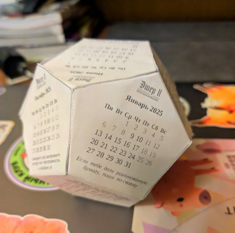
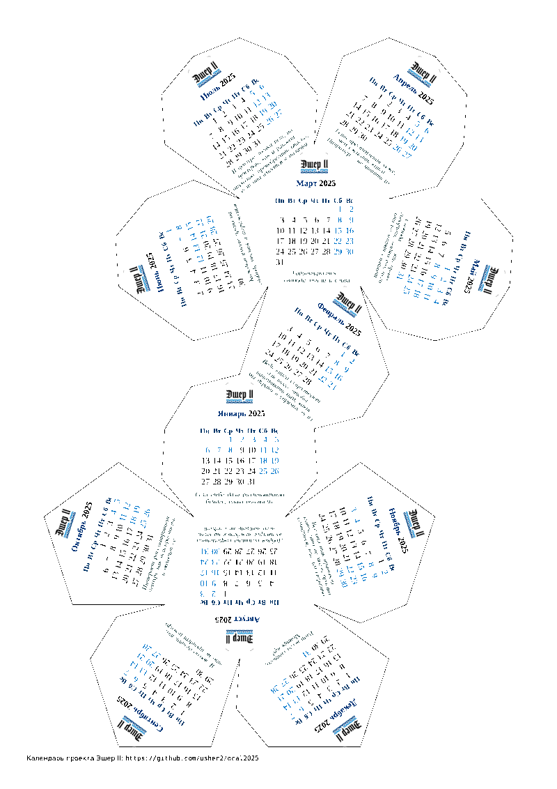
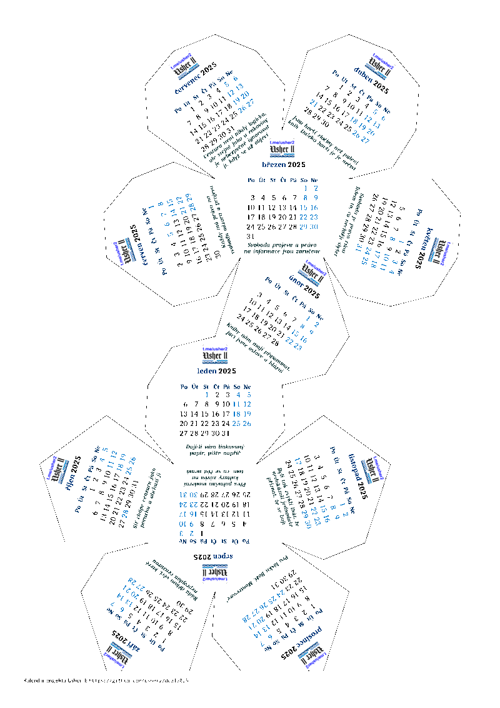
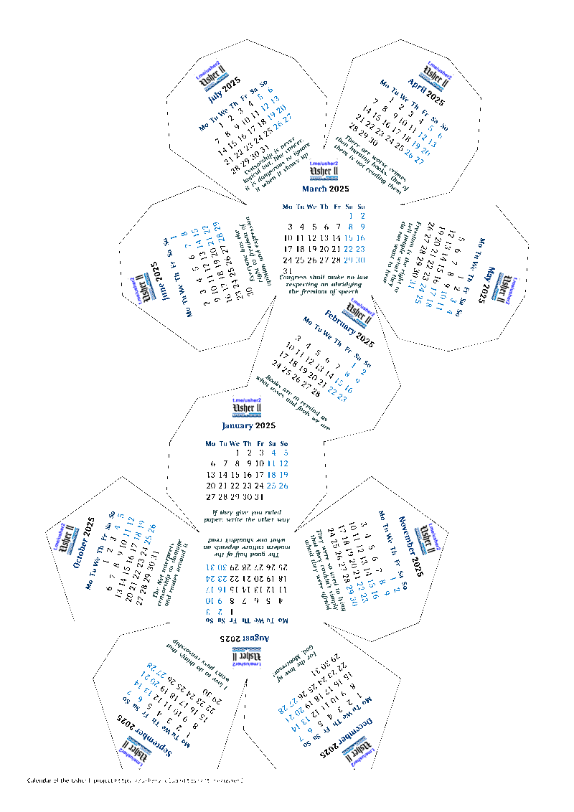
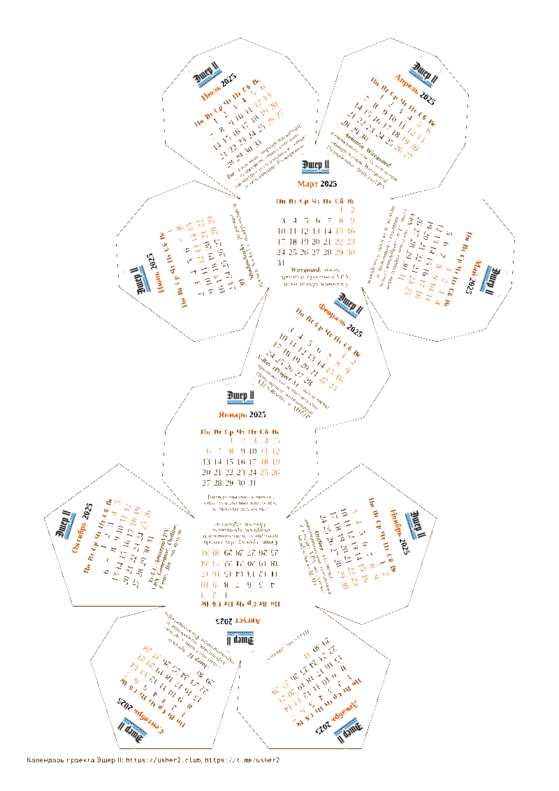
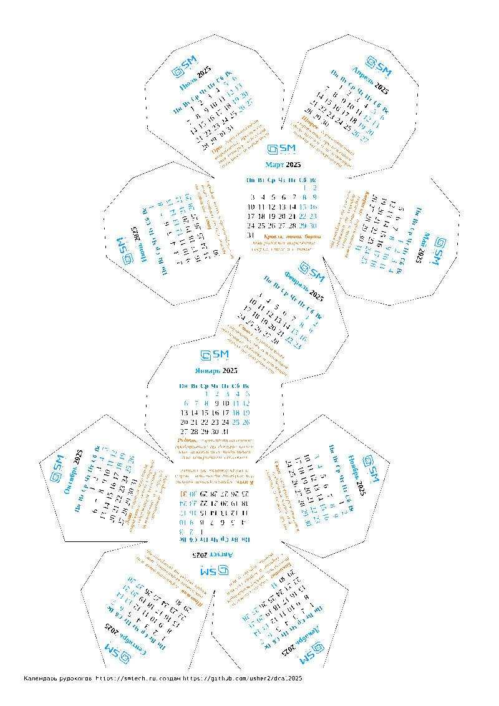

Dodecahedron desk calendar 2025
----------------------------------------------

* [Usher II Telegram channel (Russian language)](https://t.me/usher2)
* [Usher II site (not updated long time)](https://usher2.club)

* Usher II branding
* Created with LaTeX

# Calendars

|   |   |
| :---: | :---: |
|   |   |
| **🇷🇺 Свобода слова** | **🇨🇿 Svoboda slova** |
|  |  |
| [RU freedom of speech Legend in RUSSIAN](README-RUS.md) | [CZ freedom of speech in CZECH](README-CZE.md) |
|   |   |
| **🇺🇸 Freedom of speech** | **🇷🇺 VPN** |
|  |  |
| [EN freedom of speech Legend in ENGLISH](README-ENG.md) | **Различай X-Ray и AmneziaVPN** |
|   |   |
| **🇷🇺 SM Tech** |  |
|  |  |
| **Отличи бакштаг от квершлага** | - |

---

